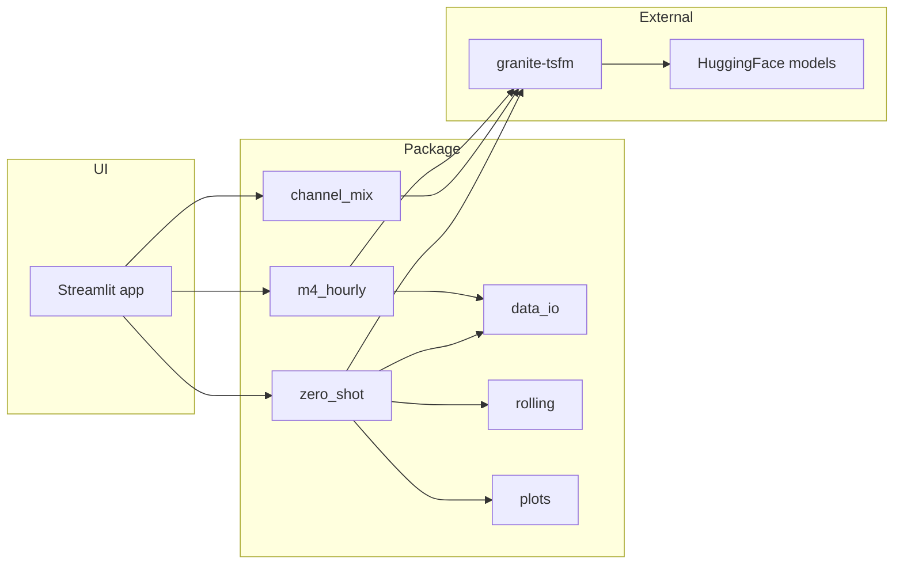

<div align="center">

# DeepTime

**Interactive forecasting on your time series—powered by IBM Granite.**

[](https://www.python.org/)
[](LICENSE)
[](https://streamlit.io)
[](https://github.com/fraware/deeptime/actions)

<br />


<br />

[Features](#what-you-can-do) · [Quick start](#quick-start) · [Docker](#docker) · [Docs](#repository-map) · [Contributing](CONTRIBUTING.md)

</div>

---

DeepTime is a **browser-based dashboard** for experimenting with **IBM Granite** time-series models. Upload a CSV or use built-in samples, then run **zero-shot** inference, a **channel-mix fine-tuning** walkthrough, or an **M4 hourly** benchmark—all without writing a training script first.

Under the hood, the app uses **[granite-tsfm](https://github.com/ibm-granite/granite-tsfm)** and **Tiny Time Mixer (TTM)** weights from **[Hugging Face](https://huggingface.co/ibm-granite)**. When you need a longer horizon than the model’s native output length, optional **recursive extension** follows IBM’s [`RecursivePredictor`](https://github.com/ibm-granite/granite-tsfm/blob/main/tsfm_public/toolkit/recursive_predictor.py) pattern ([rolling prediction notebook](https://github.com/ibm-granite/granite-tsfm/blob/main/notebooks/hfdemo/ttm_rolling_prediction_getting_started.ipynb)).

---

## Table of contents

- **Overview:** [What you can do](#what-you-can-do) · [Repository map](#repository-map) · [Architecture](#architecture)
- **Run:** [Quick start](#quick-start) · [Where to run](#where-to-run) · [Docker](#docker) · [Hugging Face Spaces](#hugging-face-spaces)
- **Use:** [Modes in the app](#modes-in-the-app) · [Parameters](#parameters) · [Data format](#data-format) · [Reading results](#reading-results)
- **Develop:** [Development & CI](#development--ci) · [Contributing](CONTRIBUTING.md) · [License](#license)

---

## What you can do

| Capability | What it means |
|-------------|----------------|
| **Zero-shot forecasting** | Load ETTh1 by default or your own CSV; evaluate a pretrained TTM without training. |
| **Smart timestamps** | On upload, pick among detected date/time columns; values are parsed and checked for sensible ordering. |
| **Longer horizons** | Add “rolling” steps to chain predictions; the UI notes that errors can accumulate. |
| **Channel-mix demo** | Fine-tune on bike-sharing data with a frozen backbone (see reproducibility note in the app). |
| **M4 hourly** | Pull the official wide-format training file, expand one series to long form, run **TTM v1**; optional offline fixture for smoke tests. |
| **Production-minded packaging** | Docker (Python 3.12, non-root, health check), CI on 3.11/3.12, Ruff, pytest, Dependabot. |

---

## Repository map

| Location | Role |
|----------|------|
| [`granite-forecasting-tool/`](granite-forecasting-tool/) | **Application home** — `app.py`, dependencies, Docker, tests |
| [`granite_forecasting/`](granite-forecasting-tool/granite_forecasting/) | **Python package** — data I/O, modes, plots, recursive forecasting |
| [`tests/`](granite-forecasting-tool/tests/) | Pytest + [`fixtures`](granite-forecasting-tool/tests/fixtures/) |
| [`.github/`](.github/) | Workflows and Dependabot |
| [`assets/`](assets/) | README artwork (SVG preview) |

A more detailed file-level index lives in [`granite-forecasting-tool/README.md`](granite-forecasting-tool/README.md).

---

## Architecture



---

## Where to run

| Environment | Command or entry | Notes |
|-------------|------------------|--------|
| **This machine** | `streamlit run app.py` inside [`granite-forecasting-tool/`](granite-forecasting-tool/) | Python **3.11+**. First runs download model weights. |
| **Docker** | Build from repo root (see [Docker](#docker)) | Same UI on port **8501**. |
| **Hugging Face Spaces** | Docker Space, context **`granite-forecasting-tool`** | Sometimes needs XSRF disabled at build time; Hub token in Space secrets if required. |
| **Your cloud** | Any OCI image from the Dockerfile | Prefer TLS + reverse proxy; keep XSRF on unless the platform forces it off. |

> **Footprint:** Evaluation modes need enough RAM and disk for PyTorch and checkpoints. **Channel-mix training** is the most demanding. GPU helps; CPU is fine for smaller batches.

---

## Quick start

```bash
git clone https://github.com/fraware/deeptime.git
cd deeptime/granite-forecasting-tool

python -m venv .venv
# Windows:    .venv\Scripts\activate
# Unix/macOS: source .venv/bin/activate

pip install --upgrade pip
pip install -r requirements.txt
# Developers: pip install -e ".[dev]"

streamlit run app.py
```

Open **http://localhost:8501**.

`granite-tsfm` is pinned to a **specific Git revision** in [`pyproject.toml`](granite-forecasting-tool/pyproject.toml) and [`requirements.txt`](granite-forecasting-tool/requirements.txt) so upgrades stay intentional.

<details>
<summary><strong>Optional — Hugging Face Hub authentication</strong></summary>

If downloads are rate-limited or gated, use a **read** token and never commit it.

- **Streamlit:** copy [`granite-forecasting-tool/.streamlit/secrets.toml.example`](granite-forecasting-tool/.streamlit/secrets.toml.example) to `secrets.toml` beside it and set `HF_TOKEN` (use `st.secrets` in code where you need it).
- **Environment:** `HF_TOKEN` or `HUGGING_FACE_HUB_TOKEN` per [huggingface_hub](https://huggingface.co/docs/huggingface_hub/package_reference/environment_variables).

</details>

---

## Docker

From the **repository root**:

```bash
docker build -f granite-forecasting-tool/Dockerfile -t deeptime-forecast granite-forecasting-tool
docker run --rm -p 8501:8501 deeptime-forecast
```

Then open **http://localhost:8501**.

<details>
<summary><strong>Build-time XSRF toggle</strong> (some hosts, e.g. certain Spaces setups)</summary>

```bash
docker build -f granite-forecasting-tool/Dockerfile \
  --build-arg STREAMLIT_ENABLE_XSRF=false \
  -t deeptime-forecast granite-forecasting-tool
```

The image sets `STREAMLIT_SERVER_ENABLE_XSRF_PROTECTION` from `STREAMLIT_ENABLE_XSRF` (default **true**). The build needs **git** because `granite-tsfm` installs from Git.

</details>

---

## Hugging Face Spaces

1. Create a **Docker** Space linked to this repo.
2. Set the build **context** to **`granite-forecasting-tool`** so `Dockerfile` and `requirements.txt` resolve.
3. If the UI fails behind the proxy, rebuild with `STREAMLIT_ENABLE_XSRF=false` (see Docker section).
4. Add **`HF_TOKEN`** / **`HUGGING_FACE_HUB_TOKEN`** as a Space secret if Hub access fails.

---

## Modes in the app

### Zero-shot

Choose the default **ETTh1** stream or **upload a CSV**. For uploads, select the **timestamp** column, **targets**, and optional **control** columns. Use **rolling extension** for horizons beyond one native prediction block; the **forecast index** slider picks which test window to plot.

### Channel-mix

Single action: loads data from [`BIKE_SHARING_CSV_URL`](granite-forecasting-tool/granite_forecasting/config.py), trains with backbone frozen. Third-party URLs can drift—snapshot the CSV if you need a frozen benchmark.

### M4 hourly

Select a **row** in the official wide **Hourly-train.csv**; the app reshapes it to `date` + `target` and runs **TTM v1**. Enable the **fixture** checkbox to use `tests/fixtures/m4_hourly_sample.csv` without network access.

---

## Parameters

| Control | Mode | Role |
|---------|------|------|
| Context length | Zero-shot | History length (default **512**). |
| Prediction length | Zero-shot | Points per native forward pass (default **96**). |
| Batch size | Zero-shot | Eval batch size. |
| Rolling extension | Zero-shot | Extra recursive steps after the native horizon. |
| Forecast index | Zero-shot | Which test example drives plots. |
| Series row index | M4 | Which wide-format row to expand. |

---

## Data format

- **File:** CSV.
- **Time:** Any parseable column on upload; ETTh1 sample uses **`date`**.
- **Targets:** One or more numeric columns.
- **Controls:** Optional exogenous columns where the preprocessor supports them.

```csv
date,HUFL,HULL,MUFL,MULL,LUFL,LULL,OT,exog1
2020-01-01 00:00,100,120,130,140,150,160,170,0.5
```

---

## Reading results

| Output | Meaning |
|--------|---------|
| **Metrics JSON** | `Trainer.evaluate` on the held-out split (exact keys depend on model/config). |
| **Plotly** | Interactive actual vs forecast; with rolling, also baseline vs full recursive path. |
| **PNG files** | Saved under `dashboard_outputs/` by TSFM helpers and surfaced in the UI. |
| **Console** | Warnings are not blanket-suppressed; see a narrow PyTree `FutureWarning` filter in [`config.py`](granite-forecasting-tool/granite_forecasting/config.py). |

---

## Development & CI

| Step | Command / file |
|------|----------------|
| Lint | `ruff check .` in `granite-forecasting-tool/` |
| Test | `pytest` |
| Pipeline | [`.github/workflows/ci.yml`](.github/workflows/ci.yml) — Python **3.11** & **3.12**, Ruff, pytest, `docker build` |
| Hooks | [`.pre-commit-config.yaml`](.pre-commit-config.yaml) (optional) |

For tighter supply-chain pinning than the fixed `granite-tsfm` commit, consider **`uv lock`** or **`pip-tools`** on top of the existing manifests.

---

## Contributing

Guidelines, fork workflow, and CI expectations: **[CONTRIBUTING.md](CONTRIBUTING.md)**.

---

## License

**Apache 2.0** — see [LICENSE](LICENSE).
